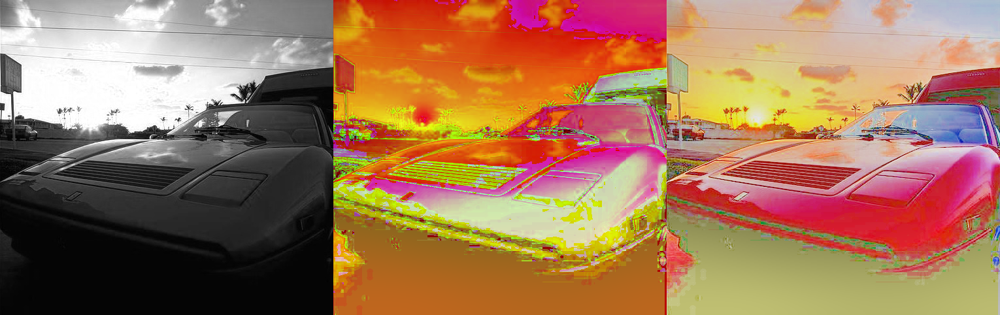

# Multiscale retinex with color restoration

## Description
Python implementation of multiscale retinex with color restoration.

### Original Image

| MSR with color restoration |  Auto MSR CR  | MSR Chromatic preservation
| --- | --- | ---

### Применение SSR к каналу яркости в модели HSV
| Brightness | HSV corrected | Final Corrected |
| --- | --- | --- | 

## Requirement
* Numpy
* OpenCV

## How to
Place test data into data folder and execute run.py.

## Reference
* [A multiscale retinex for bridging the gap between color images and the human observation of scenes] (http://ieeexplore.ieee.org/document/597272/)
* [An automated multi Scale Retinex with Color Restoration for image enhancement] (http://ieeexplore.ieee.org/document/6176791/)
* [Multiscale Retinex] (http://www.ipol.im/pub/art/2014/107/)

https://www.youtube.com/watch?v=XtH9DfctaJk
https://stackoverflow.com/questions/10415028/how-can-i-recover-the-return-value-of-a-function-passed-to-multiprocessing-proce