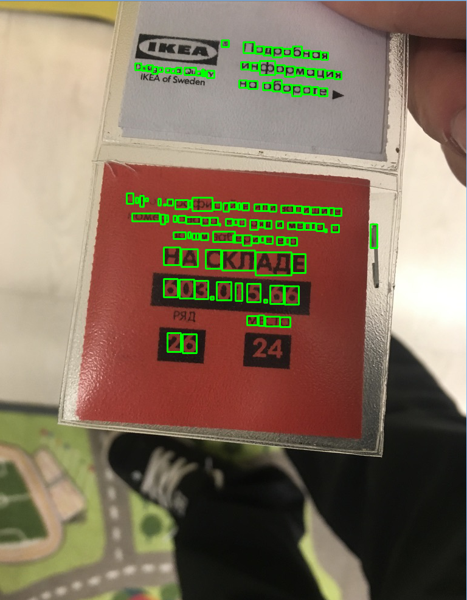

### Домашние задания по дисциплине "Системы технического зрения"
***

Ссылки на оригинальный репозиторий GitLab и его форк
https://gitlab.com/bmstu_underwater_robotics/stz
https://gitlab.com/edirab/stz

**Задание 1:** Решение СЛАУ методом Гаусса. Поиск обратной матрицы методом элементарных преобразований.
    
    /Gauss_2

**Задание 2:** Калибровка термодатчика. Апроксимация экспериментальных данных с помощью МНК.

    /Least_squares
	/RANSAC - использована робастная оценка выбросов данных

**Задание 3:** Решение ОДУ. Методы Рунге-Кутта и Эйлера

	/ode

**Задание 4:** Поиск точечных особенностей на изображении. Детекторы BRISK, SIFT & SURF

	/Feature_detecrors
	
**Задание 5:** Распознавание текста с помощью tesseract

	/OCRpy

- secondary_task_1 - проверка работоспособности Eigen 
- secondary_task_2 - построение гистограмм
- secondary_task_3 - проверка работы детекторов FAST, BRISK, SURF & SIFT. Открытие видео на чтение

***

***

*NB 1:* Запуск Jupyter Notebook не из родительского каталога 
    
    jupyter notebook --notebook-dir='E:\University\10sem\Системы технич зрения\Gauss_2\Least_squares'
	
