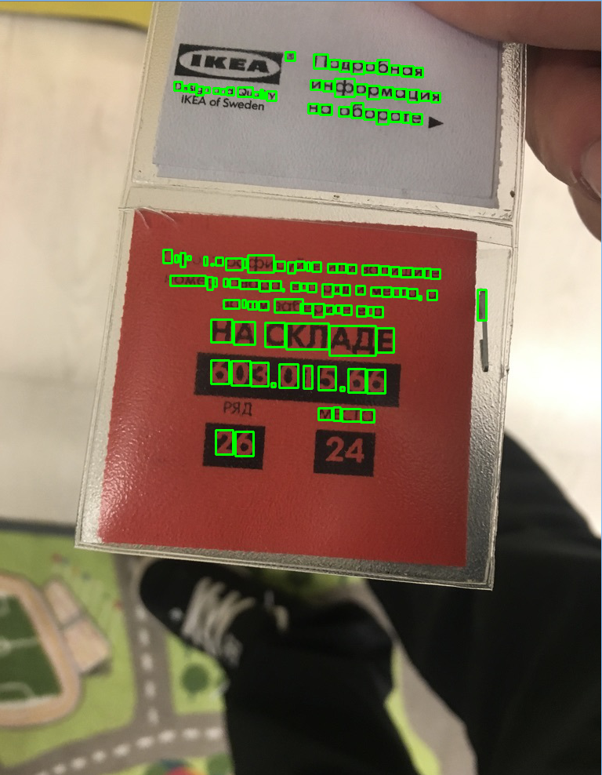
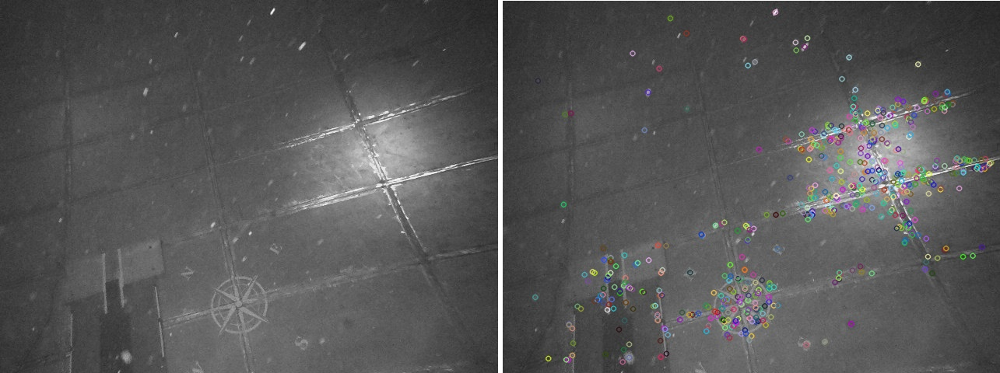

### Домашние задания по дисциплине "Системы технического зрения"
***

Ссылки на оригинальный репозиторий GitLab и его форк
https://gitlab.com/bmstu_underwater_robotics/stz
https://gitlab.com/edirab/stz

**Задание 1:** Решение СЛАУ методом Гаусса. Поиск обратной матрицы методом элементарных преобразований.
    
    10 sem/Gauss_2

**Задание 2:** Калибровка термодатчика. Апроксимация экспериментальных данных с помощью МНК.

    10 sem/Least_squares
	10 sem/RANSAC - использована робастная оценка выбросов данных

**Задание 3:** Решение ОДУ. Методы Рунге-Кутта и Эйлера

	10 sem/ode

**Задание 4:** Поиск точечных особенностей на изображении. Детекторы BRISK, SIFT & SURF

	10 sem/Feature_detecrors
	
**Задание 5:** Распознавание текста с помощью tesseract

	/OCRpy

**Второстепенное**

    10 sem/secondary_task_1 - проверка работоспособности Eigen 
    10 sem/secondary_task_2 - построение гистограмм
    10 sem/secondary_task_3 - проверка работы детекторов FAST, BRISK, SURF & SIFT. Открытие видео на чтение

**Проекты 9-го семестра:**

	9 sem/AnalyzeParcel
	9 sem/dList
	9 sem/ROVScheduler

***
*Распознавание текста с на OpenCV & Tesseract*

***

*Поиск точечных особенностей на фото люка комингс-платформы*

*Склейка изображений (image stitching)*

***

*NB 1:* Запуск Jupyter Notebook не из родительского каталога:
    
    jupyter notebook --notebook-dir='E:\University\10sem\Системы технич зрения\Gauss_2\Least_squares'
	
или:
- В адресной строке проводника набрать `cmd` (открытие командной строки в текущей директории) и в ней ` jupyter notebook`

	git ls-files 
	git ls-tree --full-tree -r --name-only HEAD
	
